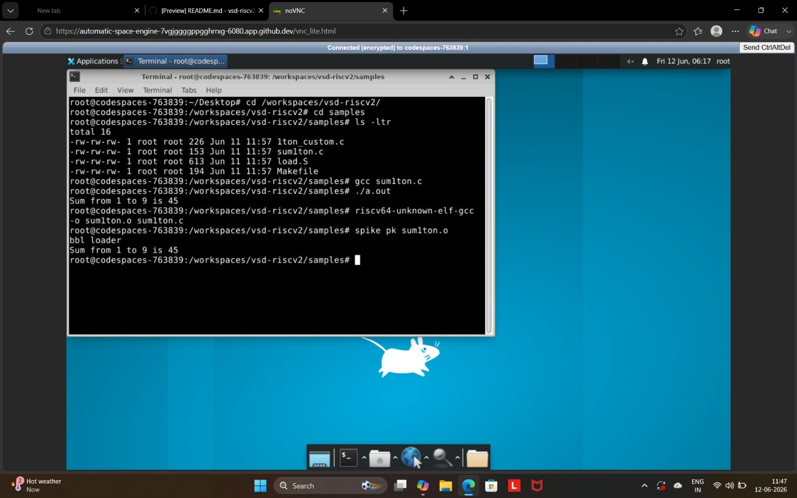

# Day 1
## Binary Number System

The binary number system uses only two digits: **0** and **1**. A single binary digit is called a **bit**. A group of 8 bits forms a **byte**, 32 bits form a **word**, and 64 bits form a **double word**. For an n-bit binary number, the total number of possible combinations is **2ⁿ**.

## Unsigned Numbers

Unsigned binary numbers represent only **non-negative values (0 and positive integers)**. They do not contain a sign bit. For example, `00000001` represents the decimal value **1**.

## Signed Numbers

Signed binary numbers use the **Most Significant Bit (MSB)** to indicate the sign of the number. An MSB of **0** represents a positive number, while an MSB of **1** represents a negative number. For example, in the 8-bit number `10000010`, the MSB is `1`, indicating a negative value.
##code for day 1
```#include <stdio.h>

int main() {
int i, sum = 0, n = 9;
for (i=1; i <= n; ++i) {
sum += i; }
printf("Sum of numbers from 1 to %d is %d\n", n, sum);
return 0;

}
```
##  image1




### image1: Compilation and Execution of C Program

This screenshot shows the compilation and execution of the `sum1ton.c` program. The program was first compiled using the GCC compiler and executed to calculate the sum of numbers from 1 to 9. The same program was then compiled using the RISC-V GCC toolchain and run on the Spike RISC-V simulator, producing the correct output.


## image2

.png)

## image3

.png)

### image3: Program Modification and Execution on RISC-V Simulator

This screenshot shows the modification of the `sum1ton.c` program using the `gedit sum1ton.c` command. After editing the program, it was compiled using the RISC-V GCC compiler and executed on the Spike RISC-V simulator using `spike pk sum1ton.o`. The output confirms the successful calculation of the sum of numbers from 1 to 12, which is 78.


